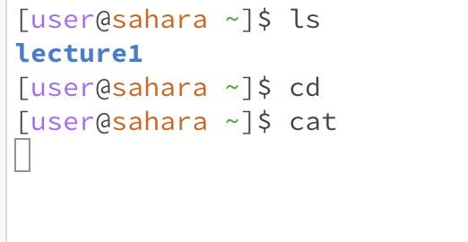
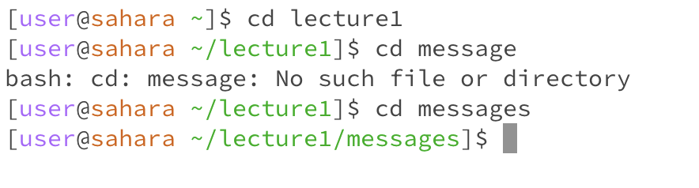
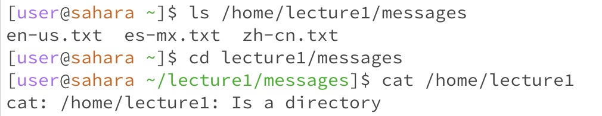
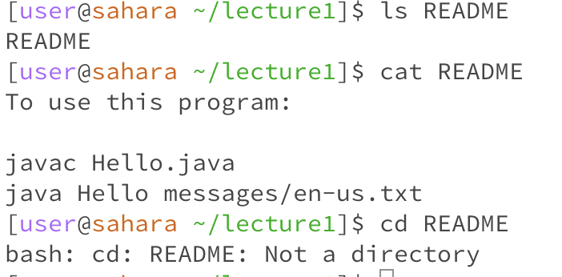

# Lab Report 1
1. Commands with no arguments
>
- all working directory for the 3 commands are home
- 
- when cd in the /home/lecture1 directory, subdirectory of lecture1, message, can be reached. 
- For "ls" command, the result displayed subdirectory "lecture1" as ls command shows the content of current directory.
- For "cd" command, the directory was not changed due to the lack of argument，since cd no argument would return to home directory.
- For "cat" command, no content was displayed due to the lack of argument.

- when name was entered after the cat command, name was printed, and control C ended this command. 

2. Commands with directory argument
>
- working director for "ls" and "cd" command is home, for "cd" command is messages
- For "ls" command, the result displayed files in the directory messages as the files are the content of directory argument messages. Both name of directores and files will be displayed.
- For "cd" command, the directory was changed to its directory argument messages.
- For "cat" command, the output was an error, because cat command cannot work with directory arguments.

3. Commands with file argument
> 
- working directory for all was lecture1
- For "ls" command, the result display the name of the file argument. Becuase ls show the name of the file argument when use upon files. 
- For "cd" command, the output was an error, because "cd" command cannot work with file arguments.
- For "cat" command, the output was the content of the file argument *README*.
     
