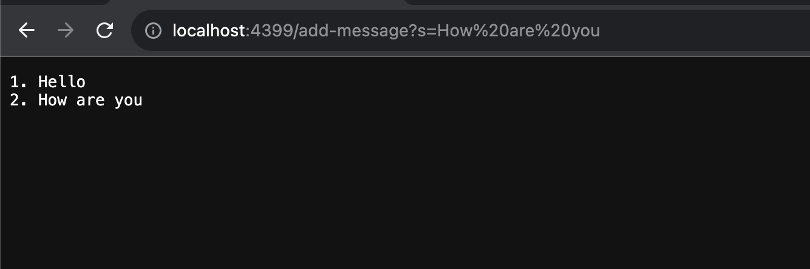

# CSE 15L Lab Report 2
Part 1

1. The method handleRequest(URI url) was called in which the add-message method as use to add "1. Hello" to my server page. 
2. The relavent arguments is the argument for method handleRequest, "add-message". The values in the relevant field Handlers are interger num, String str, String[] parameters, and String newmes
3. The values changes as I add the string "1.Hello". The num increase from 0 to 1,s=Hello was added to parameters value "1. Hello" was added to newmes, and newmes was stored as str which was returned.

1. The method handleRequest(URI url) was called in which the add-message method as use to add "2. How are you" to my server page. 
2. The relavent arguments is the argument for method handleRequest, "add-message". The values in the relevant field Handlers are interger num, String str, String[] parameters, and String newmes
3. The values changes as I add the string "2. How are you". The num increase from 1 to 2,s=How%20are%20you was added to parameters value "2. How are you" was added to newmes, and newmes was stored as str which was returned.

Part 2

part3
In week 2 and 3, I learned the specific functions/meaning of parts of a url that I encountered everyday. Not only that, through the skill demo practices and the lab reports, I begin to understand how to write code for a website to achieve certain functions such as increment and add phrases. 

   

